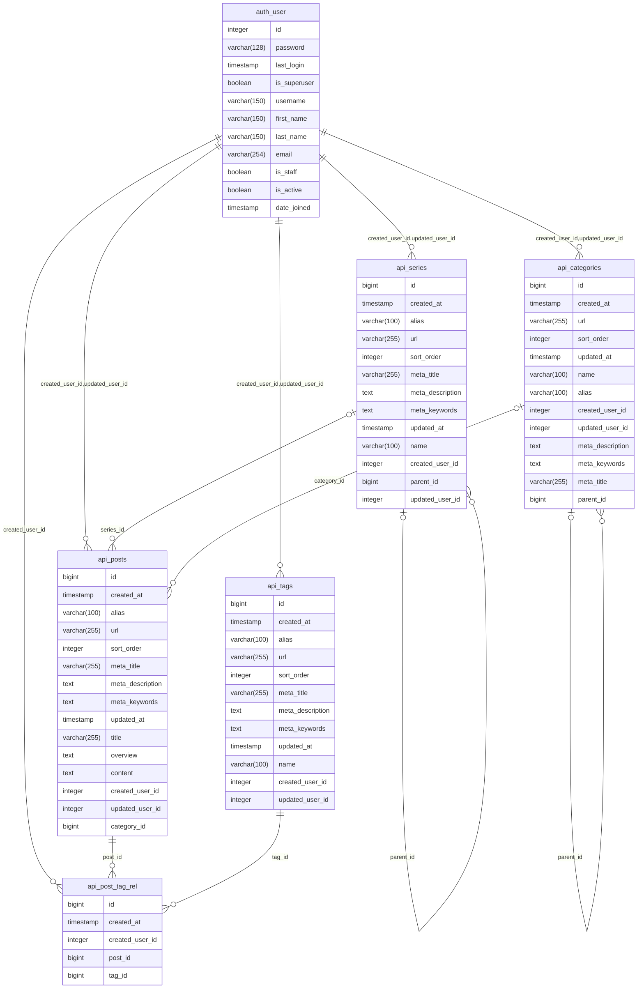

# ER 図

```mermaid
erDiagram
    auth_user       ||--o{ api_series : "created_user_id,updated_user_id"
    auth_user       ||--o{ api_categories : "created_user_id,updated_user_id"
    auth_user       ||--o{ api_posts : "created_user_id,updated_user_id"
    auth_user       ||--o{ api_tags : "created_user_id,updated_user_id"
    auth_user       ||--o{ api_post_tag_rel : "created_user_id"
    api_series      |o--o{ api_posts : "series_id"
    api_categories  |o--o{ api_posts : "category_id"
    api_posts       ||--o{ api_post_tag_rel : "post_id"
    api_tags        ||--o{ api_post_tag_rel : "tag_id"
    api_series      |o--o{ api_series : "parent_id"
    api_categories  |o--o{ api_categories : "parent_id"

    auth_user {
        integer id
        varchar(128) password
        timestamp last_login
        boolean is_superuser
        varchar(150) username
        varchar(150) first_name
        varchar(150) last_name
        varchar(254) email
        boolean is_staff
        boolean is_active
        timestamp date_joined
    }

    api_series {
        bigint id
        timestamp created_at
        varchar(100) alias
        varchar(255) url
        integer sort_order
        varchar(255) meta_title
        text meta_description
        text meta_keywords
        timestamp updated_at
        varchar(100) name
        integer created_user_id
        bigint parent_id
        integer updated_user_id
    }

    api_categories {
        bigint id
        timestamp created_at
        varchar(255) url
        integer sort_order
        timestamp updated_at
        varchar(100) name
        varchar(100) alias
        integer created_user_id
        integer updated_user_id
        text meta_description
        text meta_keywords
        varchar(255) meta_title
        bigint parent_id
    }

    api_posts {
        bigint id
        timestamp created_at
        varchar(100) alias
        varchar(255) url
        integer sort_order
        varchar(255) meta_title
        text meta_description
        text meta_keywords
        timestamp updated_at
        varchar(255) title
        text overview
        text content
        integer created_user_id
        integer updated_user_id
        bigint category_id
    }

    api_tags {
        bigint id
        timestamp created_at
        varchar(100) alias
        varchar(255) url
        integer sort_order
        varchar(255) meta_title
        text meta_description
        text meta_keywords
        timestamp updated_at
        varchar(100) name
        integer created_user_id
        integer updated_user_id
    }

    api_post_tag_rel {
        bigint id
        timestamp created_at
        integer created_user_id
        bigint post_id
        bigint tag_id
    }
```
